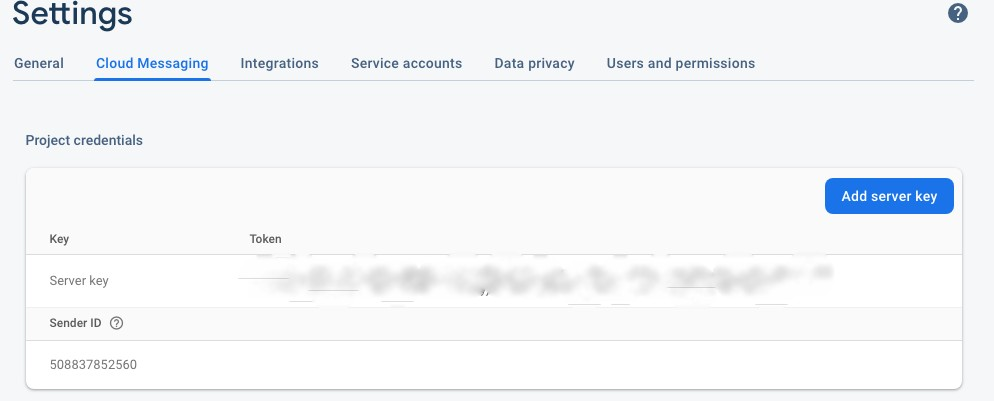
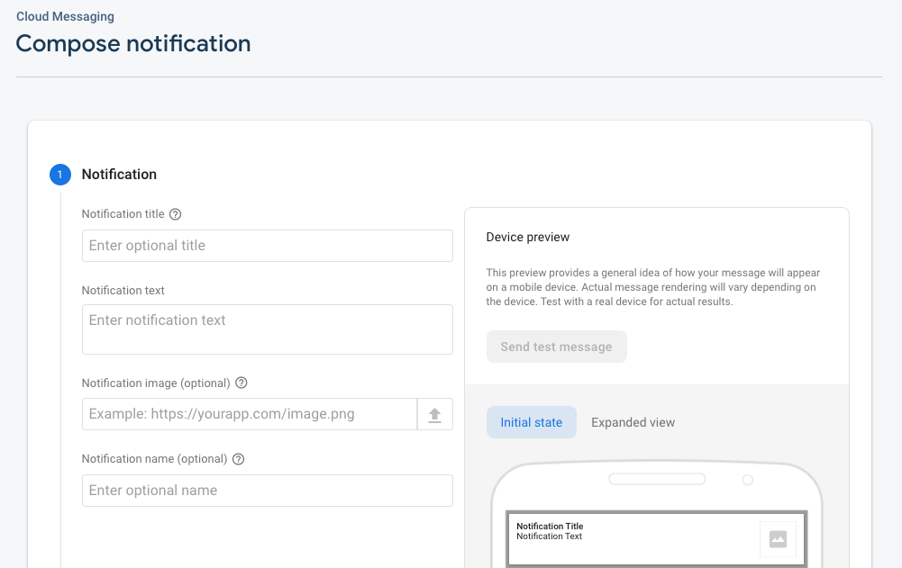
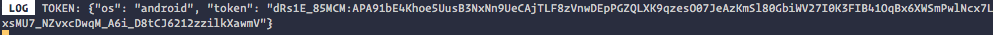
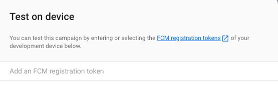

# RNnotifications

## Requirements
* Node
* npm
* react native cli
* Android Studio
* Firebase project

## To run the app
* Clone the repo
```
git clone https://github.com/akib22/RNnotifications

cd RNnotifications
```
* Install packages
```
npm i
```
* Run app
```
npm start

npm run android
```

## To get push notifications
* change the Sender ID from RemotePushController.js file to your Firebase project Sender Id.

* Compose a cloud message from your Firebase project.

* Copy FCM registration token from Log.

* Add FCM registration token into Firebase project.

